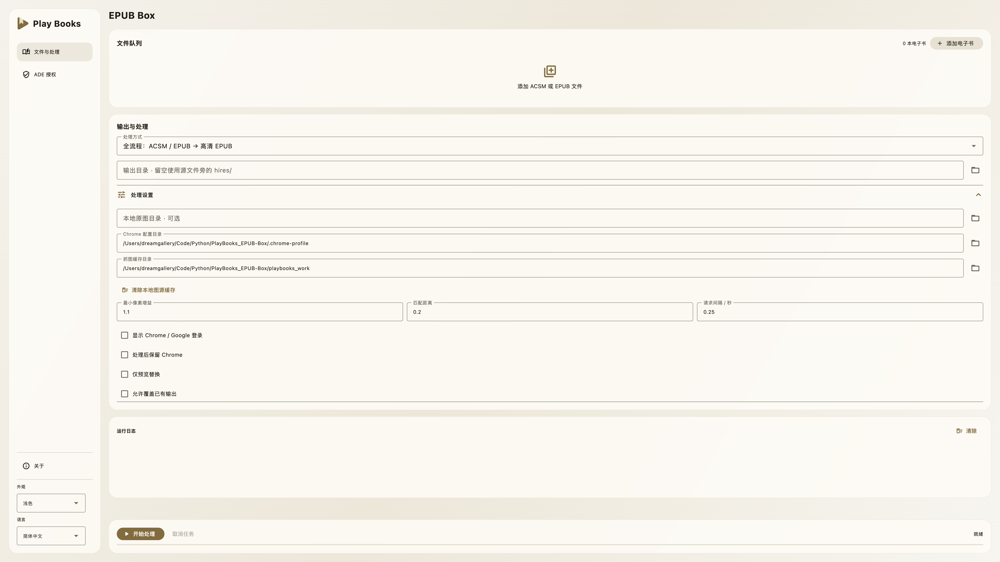

# Play Books EPUB Box

将 Google Play 图书高清原始插图匹配并替换到 EPUB，无需安装 ADE 或 Calibre。

## 界面预览



## 安装与启动

先安装 [Miniconda](https://www.anaconda.com/docs/getting-started/miniconda/install) 和 Chrome 或 Edge。以下使用独立的 Python 3.12 环境。项目应放在当前用户可写的短路径，例如 `C:\Users\你的用户名\PlayBooks`，避免系统目录及公共同步目录。

首次安装：Windows 打开 Miniconda 的 Anaconda Prompt，macOS 打开已初始化 conda 的终端；先进入项目目录，再执行：

```sh
conda create -n epub python=3.12
conda activate epub
pip install -r requirements.txt
python playbooks_app.py gui
```

先在「ADE 授权」导入已有授权或登录授权；首次下载 Google 原图时勾选显示浏览器，完成 Google 登录。后续默认无窗口运行，完成后关闭本工具启动的浏览器。

## CLI

先执行 `conda activate epub`，再在项目目录运行以下命令：

```sh
python playbooks_app.py status
python playbooks_app.py process --input "书籍.acsm" --show-browser
python playbooks_app.py process --input "书籍.epub" --id "卷ID"
python playbooks_app.py process --input "书籍.acsm" --prepare-only
python playbooks_hires.py inspect --epub "书籍.epub"
```

默认输出到输入文件旁的 `hires/书名.epub`；优先采用 Play 图书元数据书名，回退到 EPUB 书名。统一处理入口不会默认覆盖已有输出。更多参数见 `--help` 和 [使用说明](docs/QUICKSTART.md)。

## 目录与隐私

实现位于 `src/playbooks/`；根目录的三个 Python 文件分别提供统一入口、GUI 入口与抓图 CLI。

- `.playbooks-state/`：ADE 授权和准备后的 EPUB。
- `.chrome-profile/`：独立浏览器登录配置。
- `playbooks_work/`：原图与章节缓存；可在 GUI 中移至回收站。
- `.flet-settings.json`：外观和语言偏好。

默认路径相对于项目目录。授权、登录配置、书籍和缓存已列入 `.gitignore`，仍请勿手动上传或公开共享。Windows 下这些文件沿用所在目录的访问权限，请使用自己的用户目录。

仅处理有权使用的书籍；预览内容不保证包含全部插图。感谢 DeACSM 与 DeDRM，第三方版本、修改和许可见 [第三方说明](docs/THIRD_PARTY.md)。
